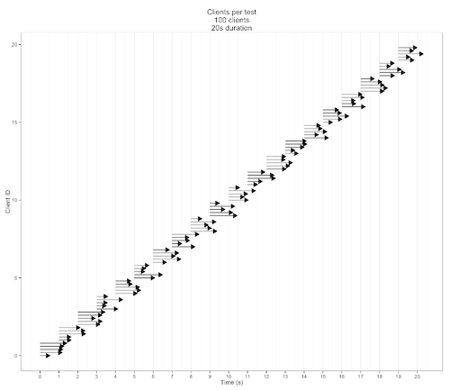
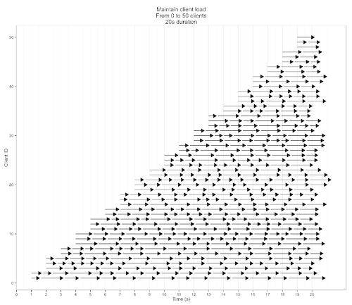

# perst [](https://travis-ci.com/DasRed/perst) [](https://coveralls.io/github/DasRed/perst?branch=main)

perst is a wrapper around LoaderIO, which can be configured and run in your commandline multiple tests and validates the measureable values like AVG Response Time and AVG Error Rate.

## Table of Contents

* [Command Line Options](#command-line-options)
* [Configuration files](#configuration-files)
* [Big list of configuration options](#big-list-of-configuration-options)
	* [`version`](#version)
	* [`api`](#api)
		* [`api.token`](#apitoken)
		* [`api.server`](#apiserver)
		* [`api.version`](#apiversion)
	* [`app`](#app)
		* [`api.domain`](#apidomain)
	* [`tasks`](#tasks)
		* [`tasks.[name].name`](#tasksnamename)
		* [`tasks.[name].type`](#tasksnametype)
			* [Task Type "Clients per test" `per-test`](#task-type-clients-per-test-per-test)
			* [Task Type "Clients per second" `per-second`](#task-type-clients-per-second-per-second)
			* [Task Type "Maintain client load" `maintain-load`](#task-type-maintain-client-load-maintain-load)
* [Configuration Examples](#configuration-examples)
	* [YAML](#yaml)
	* [JSON](#json)
	* [JavaScript](#javascript)

## Command Line Options

Usage: perst [options]

Basic options:

| Switch                  | Description                                                                               |
| ----------------------- | ----------------------------------------------------------------------------------------- |
| -c, --config FILENAME   | Use this config file (if argument is used but value is unspecified, defaults to .perstrc) |
| -d, --dry-run           | Runs all test in dry-run mode                                                             |
| -h, --help              | Show this help message                                                                    |
| -v, --version           | Show version number                                                                       |
| --ci                    | Runs this on a CI                                                                         |
| --dump-config \[FORMAT] | dumps the config to the stdout in given format (yaml, yml, json, js). Default: yaml       |
| -f, --filter PATTERN    | filters the task by given regex. The name attribute will be used with the regex           |
| --color                 | force the output with colors                                                              |
| --no-color              | force the output without colors                                                           |
| --list-tasks            | lists all available tasks                                                                 |
| -s, --silent            | silent mode                                                                               |
| --stop-on-failure       | stops the tasks execution, if a task fails                                                |

## Configuration files

At the following locations in the root directory and format can be placed the configuration.

The files will be searched in this order. The first match will be used.

- package.json `{ "perst": {...} }`
- .perstrc yaml
- .perstrc.json json
- .perstrc.yaml yaml
- .perstrc.yml yaml
- .perstrc.js javascript
- .perstrc.cjs common js
- perst.config.js javascript
- perst.config.cjs common js

Or you run perst with the command line switch -c.

## Big list of configuration options

You can use environment variables in your configuration. Environment variables are only supported in YAML Files. Every environment variable can be written in the format `$NAME` or `${NAME}`. Only existing environment variables will replaced.

### `version`

Defines the version of the configuration file.

- **Required:** false
- **Type:** Number
- **Values:** 1
- **Default:** 1

### `api`

Defines some api information currently for [loader IO](https://dasred.github.io/loader.io). 

- **Required:** true
- **Type:** Object

#### `api.token`

Defines the [loader IO API](http://docs.loader.io/api/intro.html) token. 

- **Required:** true
- **Type:** String

#### `api.server`

Defines the [loader IO API](http://docs.loader.io/api/intro.html) server url. 

- **Required:** false
- **Type:** String
- **Default:** https://api.loader.io

#### `api.version`

Defines the [loader IO API](http://docs.loader.io/api/intro.html) version. 

- **Required:** false
- **Type:** String
- **Values:** v2
- **Default:** v2

### `app`

Defines some application options. 

- **Required:** true
- **Type:** Object

#### `api.domain`

Defines the domain for load testing. The domain must be defined in [loader IO](https://loader.io/targets) and must be verified. 

- **Required:** true
- **Type:** String
- **Example:** https://www.example.de

### `tasks`

Defines every task which should be run. This is an object of tasks. 

- **Required:** true
- **Type:** Object

#### `tasks.[name].name`

Defines the name of the task in loader IO. This name will be used to find an existing task to reuse and rerun them. If no task can be found with this name, the task will be created.

- **Required:** true
- **Type:** String

#### `tasks.[name].type`

Defines the test type for the task. The article [Test Types](https://support.loader.io/article/16-test-types) and [Understanding the different test types]
(https://loader.io/blog/2014/07/16/understanding-different-test-types/) describe detailed information about the test type.

- **Required:** false
- **Type:** String
- **Values:** per-test, per-second, maintain-load
- **Default:** per-second

##### Task Type "Clients per test" `per-test`
With the "Clients per test" type, you specify the total number of clients to connect to your application over the duration of the test. 
If you specify 20000 clients for a 20-second test, 1000 clients will connect each second during that test.



##### Task Type "Clients per second" `per-second`
The "Clients per second" type is similar to "Clients per test", but instead of specifying the total, you specify the number of clients to 
start each second. A 20-second test with 1000 clients per second is the same as a 20-second test at 20000 clients per test.


##### Task Type "Maintain client load" `maintain-load`
This test allows you to specify a _from_ and a _to_ value for clients. If you specify 0 and 10000 here for example, the test will start with 
0 clients and increase up to 10000 simultaneous clients by the end of the test.




## Configuration Examples

### YAML

```yaml
version: 1
api:
    token:   bb74abe565ec005944ffcbfa846431e1
    server:  https://api.loader.io
    version: v2

app:
    domain: https://www.example.com

tasks:
    tasks1:
        name:         Task 1
        type:         per-second
        duration:     60
        clientsStart: 1
        clients:      25
        timeout:      10000
        notes:        "some notes"
        tags:
            - tag 1
            - tag 2
        threshold:
            avgResponseTime: 500
            avgErrorRate:    50
        request:
            path:        /nuff/narf
            type:        GET
            payloadFile: https://www.example.de/file
            headers:
                accept-encoding: gzip
            parameters:
                -   name:  parameter 1
                    value: value of parameter 1
                -   name:  parameter 2
                    value: value of parameter 2
            authentication:
                type:     basic
                login:    login
                password: password
            variables:
                -   name:     variable 1 name
                    property: variable 1 property
                    source:   variable 1 source
                -   name:     variable 2 name
                    property: variable 2 property
                    source:   variable 2 source
    tasks2:
        name:     Task 2
        duration: 60
        clients:  25
        threshold:
            avgResponseTime: 500
            avgErrorRate:    0
        requests:
            -   path: /nuff/narf
            -   path: /rofl/copoter
```

### JSON

```json
{
    "version": 1,
    "api": {
        "token": "bb74abe565ec005944ffcbfa846431e1",
        "server": "https://api.loader.io",
        "version": "v2"
    },
    "app": {
        "domain": "https://www.example.com"
    },
    "tasks": {
        "tasks1": {
            "name": "Task 1",
            "type": "per-second",
            "duration": 60,
            "clientsStart": 1,
            "clients": 25,
            "timeout": 10000,
            "notes": "some notes",
            "tags": [
                "tag 1",
                "tag 2"
            ],
            "threshold": {
                "avgResponseTime": 500,
                "avgErrorRate": 50
            },
            "request": {
                "path": "/nuff/narf",
                "type": "GET",
                "payloadFile": "https://www.example.de/file",
                "headers": {
                    "accept-encoding": "gzip"
                },
                "parameters": [
                    {
                        "name": "parameter 1",
                        "value": "value of parameter 1"
                    },
                    {
                        "name": "parameter 2",
                        "value": "value of parameter 2"
                    }
                ],
                "authentication": {
                    "type": "basic",
                    "login": "login",
                    "password": "password"
                },
                "variables": [
                    {
                        "name": "variable 1 name",
                        "property": "variable 1 property",
                        "source": "variable 1 source"
                    },
                    {
                        "name": "variable 2 name",
                        "property": "variable 2 property",
                        "source": "variable 2 source"
                    }
                ]
            }
        },
        "tasks2": {
            "name": "Task 2",
            "duration": 60,
            "clients": 25,
            "threshold": {
                "avgResponseTime": 500,
                "avgErrorRate": 0
            },
            "requests": [
                {"path": "/nuff/narf"},
                {"path": "/rofl/copoter"}
            ]
        }
    }
}
```

### JavaScript

```javascript
export default {
    "version": 1,
    "api": {
        "token": "bb74abe565ec005944ffcbfa846431e1",
        "server": "https://api.loader.io",
        "version": "v2"
    },
    "app": {
        "domain": "https://www.example.com"
    },
    "tasks": {
        "tasks1": {
            "name": "Task 1",
            "type": "per-second",
            "duration": 60,
            "clientsStart": 1,
            "clients": 25,
            "timeout": 10000,
            "notes": "some notes",
            "tags": [
                "tag 1",
                "tag 2"
            ],
            "threshold": {
                "avgResponseTime": 500,
                "avgErrorRate": 50
            },
            "request": {
                "path": "/nuff/narf",
                "type": "GET",
                "payloadFile": "https://www.example.de/file",
                "headers": {
                    "accept-encoding": "gzip"
                },
                "parameters": [
                    {
                        "name": "parameter 1",
                        "value": "value of parameter 1"
                    },
                    {
                        "name": "parameter 2",
                        "value": "value of parameter 2"
                    }
                ],
                "authentication": {
                    "type": "basic",
                    "login": "login",
                    "password": "password"
                },
                "variables": [
                    {
                        "name": "variable 1 name",
                        "property": "variable 1 property",
                        "source": "variable 1 source"
                    },
                    {
                        "name": "variable 2 name",
                        "property": "variable 2 property",
                        "source": "variable 2 source"
                    }
                ]
            }
        },
        "tasks2": {
            "name": "Task 2",
            "duration": 60,
            "clients": 25,
            "threshold": {
                "avgResponseTime": 500,
                "avgErrorRate": 0
            },
            "requests": [
                {"path": "/nuff/narf"},
                {"path": "/rofl/copoter"}
            ]
        }
    }
}
```
